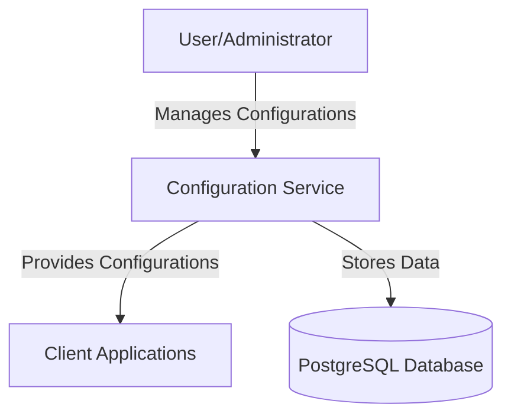
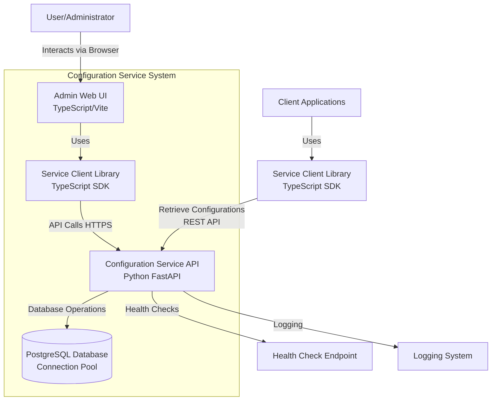
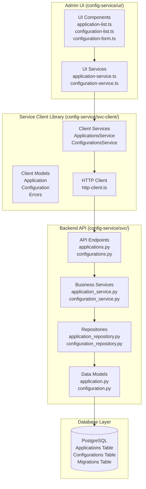

# Configuration Service Architecture

## System Overview

The Configuration Service is a centralized, flexible configuration management system designed to provide dynamic runtime configuration updates across diverse software applications. It enables organizations to manage application settings efficiently, supporting multiple application types with a unified approach while maintaining security, scalability, and operational simplicity.

## Architecture Diagrams

### Level 0 Context Diagram



### Level 1 Container Diagram



## Core Components

### Level 2 Component Diagram



### Service Client Library (TypeScript SDK)
**Location**: `config-service/svc-client/`

The Service Client Library is a TypeScript SDK that provides a clean, type-safe interface for interacting with the Configuration Service API. It abstracts HTTP communication details and provides consistent error handling.

#### Key Components:
1. **Services** (`src/services/`)
   - `ApplicationsService`: Application CRUD operations
   - `ConfigurationsService`: Configuration management operations
   - `BaseService`: Common HTTP client functionality

2. **Models** (`src/models/`)
   - Type-safe data models for API requests/responses
   - `Application`: Application entity model
   - `Configuration`: Configuration entity model
   - `Errors`: Standardized error handling types

3. **HTTP Client** (`src/utils/`)
   - Centralized HTTP communication
   - Request/response interceptors
   - Error handling and retry logic
   - Type-safe API calls

4. **Integration Tests** (`tests/integration/`)
   - End-to-end testing of client functionality
   - API contract validation
   - Error scenario testing

#### Architecture Benefits:
- **Type Safety**: Full TypeScript support with compile-time validation
- **Consistency**: Standardized API interaction patterns
- **Reusability**: Shared between Admin UI and external client applications
- **Maintainability**: Centralized API logic reduces duplication
- **Testing**: Comprehensive integration test coverage

### Backend Service (Python FastAPI)
**Location**: `config-service/svc/`

#### Key Modules:
1. **API Layer** (`api/v1/`)
   - RESTful endpoint implementations
   - Request/response handling
   - Input validation and error responses
   - API versioning support

2. **Service Layer** (`services/`)
   - Business logic implementation
   - Configuration management operations
   - Application lifecycle management
   - Data validation and transformation

3. **Repository Layer** (`repositories/`)
   - Database interaction abstraction
   - CRUD operations
   - Query optimization
   - Transaction management

4. **Models** (`models/`)
   - Data models for Applications and Configurations
   - Pydantic-based validation
   - Type safety and serialization

5. **Database Management** (`database/`)
   - Connection pooling
   - Migration management
   - Asynchronous operations

### Frontend Administration UI (TypeScript)
**Location**: `config-service/ui/`

The Admin UI now uses the Service Client Library for all API interactions, providing a clean separation between UI logic and API communication.

#### Key Components:
1. **Components** (`components/`)
   - Application management interfaces
   - Configuration forms and lists
   - Responsive UI building blocks

2. **Services** (`services/`)
   - UI-specific service layer that wraps the Service Client
   - Data transformation for UI requirements
   - Error handling and user feedback

3. **Models** (`models/`)
   - UI-specific data models
   - View models for component state management

### Database Architecture (PostgreSQL)

#### Schema Structure:
1. **Migrations Table**
   - Tracks database schema versions
   - Ensures consistent deployments
   - Supports rollback capabilities

2. **Applications Table**
   - Stores application metadata
   - ULID-based unique identifiers
   - Timestamp-based auditing

3. **Configurations Table**
   - JSON-based flexible configuration storage
   - Linked to specific applications
   - Supports nested objects and arrays
   - Version tracking and audit trails

## Key Architecture Patterns

### 1. Layered Architecture
- **Presentation Layer**: Admin UI and API endpoints
- **Service Layer**: Business logic and validation
- **Repository Layer**: Data access abstraction
- **Database Layer**: PostgreSQL with connection pooling

### 2. Configuration Management Pattern
- Flexible key-value JSON configuration model
- ULID-based unique, sortable identifiers
- Per-application configuration isolation
- Runtime configuration updates without redeployment

### 3. Asynchronous Processing
- Non-blocking database operations
- Connection pooling for performance
- Concurrent request handling

### 4. API Design Patterns
- RESTful API design principles
- Consistent error response structure
- Pagination support for large datasets
- Comprehensive input validation

## Technical Decisions

### 1. Technology Stack
- **Backend**: Python FastAPI for high-performance async API
- **Frontend**: TypeScript with Vite for modern development experience
- **Database**: PostgreSQL for ACID compliance and JSON support
- **Testing**: pytest (backend), Vitest (frontend), Playwright (E2E)

### 2. Identifier Strategy
- ULID (Universally Unique Lexicographically Sortable Identifier)
- Provides uniqueness with natural sorting
- Better performance than UUID for database indexing

### 3. Configuration Model
- JSON-based flexible storage
- Supports complex nested configurations
- Schema-less approach for maximum flexibility
- Application-scoped configuration isolation

### 4. Service Client Architecture
- **TypeScript SDK**: Provides type-safe API interactions
- **Centralized HTTP Logic**: Single source of truth for API communication
- **Error Standardization**: Consistent error handling across all clients
- **Integration Testing**: Comprehensive test coverage for API contracts
- **Reusability**: Shared between Admin UI and external applications

### 5. Security Considerations
- Input validation at API layer
- CORS configuration for cross-origin requests
- Comprehensive error handling without information leakage
- Database connection security

## API Endpoints

### Applications Endpoints (`/api/v1/applications`)

| Method | Endpoint | Purpose | Response |
|--------|----------|---------|----------|
| POST | `/applications` | Create new application | 201 Created |
| GET | `/applications/{id}` | Get application by ID | 200 OK |
| PUT | `/applications/{id}` | Update application | 200 OK |
| GET | `/applications` | List applications (paginated) | 200 OK |
| GET | `/applications/{id}/configurations` | List app configurations | 200 OK |
| DELETE | `/applications/{id}` | Delete application | 204 No Content |

### Configurations Endpoints (`/api/v1/configurations`)

| Method | Endpoint | Purpose | Response |
|--------|----------|---------|----------|
| POST | `/configurations` | Create configuration | 201 Created |
| GET | `/configurations/{id}` | Get configuration by ID | 200 OK |
| PUT | `/configurations/{id}` | Update configuration | 200 OK |
| GET | `/configurations` | List configurations (paginated) | 200 OK |
| DELETE | `/configurations/{id}` | Delete configuration | 204 No Content |

### System Endpoints

| Method | Endpoint | Purpose | Response |
|--------|----------|---------|----------|
| GET | `/` | Root endpoint | Service information |
| GET | `/health` | Health check | System status |

## Error Handling Strategy

### 1. Comprehensive Error Responses
- Consistent error response structure
- Appropriate HTTP status codes
- Detailed error messages for debugging
- No sensitive information exposure

### 2. Logging Strategy
- Structured logging with different levels
- Request/response logging
- Error tracking and monitoring
- Performance metrics collection

### 3. Validation Approach
- Input validation at API boundaries
- Pydantic models for type safety
- Database constraint validation
- Business rule validation in service layer

## Testing Strategy

### Backend Testing (Python)
1. **Unit Tests** (`*_test.py`)
   - Models: `application_test.py`, `configuration_test.py`, `base_test.py`
   - Services: `application_service_test.py`
   - Configuration: `settings_test.py`
   - Main application: `main_test.py`

2. **Integration Tests**
   - Service interactions: `configuration_service_integration_test.py`
   - Database operations
   - API endpoint testing

### Service Client Testing (TypeScript)
1. **Integration Tests** (Vitest)
   - API contract validation: `configurations-service.integration.test.ts`
   - Service method testing with real API calls
   - Error handling and edge case validation
   - Configuration key counting functionality

### Frontend Testing (TypeScript)
1. **Unit Tests** (Vitest)
   - Service layer testing: `application-service.test.ts`
   - Component logic validation
   - Service client integration testing

2. **End-to-End Tests** (Playwright)
   - Complete user workflows: `application-crud.test.ts`, `configuration-crud.test.ts`
   - Configuration key count functionality: Added specific tests for key counting
   - UI interaction validation
   - Cross-browser compatibility

### Testing Framework Configuration
- **pytest**: Backend test runner with comprehensive configuration
- **Vitest**: Modern frontend testing framework
- **Playwright**: Reliable E2E testing with browser automation

## Data Requirements

### 1. Configuration Data Model
```json
{
  "id": "01ARZ3NDEKTSV4RRFFQ69G5FAV",
  "application_id": "01ARZ3NDEKTSV4RRFFQ69G5FAV",
  "name": "database_config",
  "configuration": {
    "host": "localhost",
    "port": 5432,
    "database": "myapp",
    "connection_pool": {
      "min_connections": 1,
      "max_connections": 10
    }
  },
  "comment": "Database configuration for production environment",
  "created_at": "2023-01-01T00:00:00Z",
  "updated_at": "2023-01-01T00:00:00Z"
}
```

### 2. Application Data Model
```json
{
  "id": "01ARZ3NDEKTSV4RRFFQ69G5FAV",
  "name": "my-web-application",
  "description": "Main web application for customer portal",
  "created_at": "2023-01-01T00:00:00Z",
  "updated_at": "2023-01-01T00:00:00Z",
  "configuration_ids": [
    "01ARZ3NDEKTSV4RRFFQ69G5FAV",
    "01ARZ3NDEKTSV4RRFFQ69G5FAV"
  ]
}
```

## Database Architecture Details

### Connection Management
- **Connection Pooling**: ThreadedConnectionPool (1-20 connections)
- **Asynchronous Operations**: psycopg2 with asyncio integration
- **Environment Separation**: Separate pools for production and testing
- **Transaction Management**: Automatic commit/rollback handling

### Migration Strategy
- **Version-based Migrations**: Sequential SQL migration files
- **Migration Tracking**: Dedicated migrations table
- **Rollback Support**: Structured migration management
- **Index Optimization**: Performance-focused database design

### Performance Considerations
- **Indexed Lookups**: Optimized query performance
- **Connection Reuse**: Efficient resource utilization
- **Async Operations**: Non-blocking database interactions
- **Query Optimization**: Efficient data retrieval patterns

## Deployment Considerations

### Environment Configuration
- **Environment Variables**: Configurable database connections
- **Docker Support**: Container-based deployment
- **Health Checks**: Monitoring and alerting integration
- **Logging Configuration**: Structured logging for operations

### Scalability Patterns
- **Horizontal Scaling**: Stateless service design
- **Database Optimization**: Connection pooling and indexing
- **Caching Strategy**: Future consideration for configuration caching
- **Load Balancing**: API service distribution

## Recommended Improvements

### 1. Enhanced Testing
- Expand unit test coverage for repository layer
- Add more comprehensive integration tests
- Implement contract testing between frontend and backend
- Add performance testing for high-load scenarios

### 2. Security Enhancements
- Implement authentication and authorization
- Add API rate limiting
- Enhance input sanitization
- Implement audit logging for configuration changes

### 3. Operational Improvements
- Add comprehensive monitoring and alerting
- Implement configuration change notifications
- Add backup and disaster recovery procedures
- Enhance logging with structured formats

### 4. Performance Optimizations
- Implement configuration caching layer
- Add database read replicas for scaling
- Optimize database queries and indexing
- Consider CDN for static assets

### 5. Feature Enhancements
- Configuration templating system
- Environment-specific configuration overrides
- Configuration validation schemas
- Integration with CI/CD pipelines
- Configuration rollback capabilities

## Recent Architectural Improvements

### Service Client Library Implementation
- **Added TypeScript SDK** (`config-service/svc-client/`): Provides type-safe, reusable API client
- **Centralized HTTP Logic**: All API interactions now go through the service client
- **Enhanced Type Safety**: Full TypeScript support with compile-time validation
- **Improved Testing**: Comprehensive integration tests for API contracts

### Configuration Key Count Fix
- **Root Cause**: UI service was accessing wrong property (`config.config` vs `config.configuration`)
- **Solution**: Updated `transformToListItem()` method to use correct property mapping
- **Testing**: Added E2E tests specifically for configuration key counting functionality
- **Validation**: Manual testing confirmed proper key count display and updates

### Enhanced E2E Test Coverage
- **Configuration Key Tests**: Added tests for key count display and updates
- **Empty Configuration Handling**: Added tests for zero-key configurations
- **Comprehensive Scenarios**: Tests cover creation, editing, and key count validation

### Build System Improvements
- **Vite Configuration**: Updated to allow service client library access
- **TypeScript Compilation**: Proper build pipeline for service client library
- **Development Workflow**: Improved development server configuration

## Conclusion

The Configuration Service architecture now provides an even more robust foundation for centralized configuration management. The addition of the Service Client Library creates a clean abstraction layer that improves type safety, reduces code duplication, and provides better testing capabilities. The recent fixes to the configuration key counting functionality demonstrate the system's maintainability and the effectiveness of the layered architecture approach.

The system continues to be designed for scalability and maintainability while supporting diverse application types and deployment scenarios, with enhanced developer experience through improved tooling and comprehensive test coverage.
